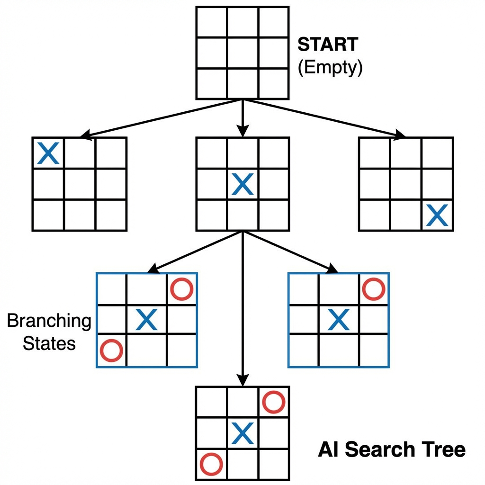

# 1.4 Problem Solving in AI

Problem solving is a core aspect of Artificial Intelligence, where an agent is goal-directed. When an agent wants to reach a specific state (goal) and the path to get there is not immediately obvious, it must engage in **problem solving**. This is typically modeled mathematically as a **search through a state space**.

## 1.4.1 Problem Space and Search

To solve a problem computationally, we must first abstract the real world into a **Problem Space**.

*   **Problem Space:** An abstract environment that defines all possible configurations of the problem. It consists of:
    *   **States:** Snapshots of the environment at any given moment.
    *   **Operators:** Actions that can be performed to transform one state into another.
*   **Search:** The systematic process of navigating through this problem space—moving from state to state using operators—to find a path from the starting point to the desired destination.

---

## 1.4.2 Defining the Problem as State Space Search

To define a problem formally for an AI agent, we require four distinct components:

1.  **Initial State:** The state in which the agent starts (e.g., the starting position of a chess board, or a robot's starting coordinates).
2.  **Goal Test:** A condition (or function) that determines whether a given state is the goal. This can be:
    *   **Explicit:** A specific state (e.g., "Checkmate").
    *   **Implicit:** A property check (e.g., "No dirt remaining" in a vacuum world).
3.  **Successor Function (Operators):** A description of the possible actions available in a given state. Formally, it returns a set of pairs: `<Action, Resulting State>`.
4.  **Path Cost:** A numeric function that assigns a cost to each path. The agent usually aims to find the solution with the *lowest* cost (optimal solution).

### Example: The 8-Puzzle

The 8-puzzle involves a 3x3 grid with 8 numbered tiles and one blank space. The goal is to slide the tiles into a specific order.

*   **States:** Examples of states are shown above. A state is defined by the location of each of the 8 tiles and the blank.
*   **Initial State:** Any arbitrary configuration (e.g., the mixed-up grid on the left).
*   **Goal State:** The ordered configuration (e.g., the grid on the right).
*   **Operators:** The blank space can essentially "move" by swapping with an adjacent tile: `Move Blank Left`, `Move Blank Right`, `Move Blank Up`, `Move Blank Down`.

---

## 1.4.3 Problem Characteristics

Before choosing a search algorithm (like BFS, DFS, or A*), we must analyze the problem's characteristics. Different problems require different approaches.

### 1. Is the problem decomposable?
*   **Yes:** The problem can be broken down into smaller, independent sub-problems.
    *   *Example:* Calculating a complex integral ($\int (x^2 + \sin x) dx$) can be split into $\int x^2 dx + \int \sin x dx$.
*   **No:** The problem must be solved as a whole; step 1 affects step 10.
    *   *Example:* The 8-Puzzle. You cannot simply "place tile 1" and then ignore it while placing "tile 2", because moving tile 2 might displace tile 1.

### 2. Can solution steps be ignored or undone?
*   **Ignorable (Theorem Proving):** If you prove a lemma that turns out to be useless, you can just ignore it and try another path. Nothing is "broken."
*   **Recoverable (8-Puzzle):** If you make a wrong move, you can backtrack (reverse the move) to return to the previous state.
*   **Irrecoverable (Chess):** Once you make a move, you cannot take it back. The state changed permanently (relative to the game rules).

### 3. Is the universe predictable?
*   **Certainty (8-Puzzle):** If you move a tile, you know *exactly* what the next state will look like. The outcome is deterministic.
*   **Uncertainty (Bridge/Poker):** You do not know what cards the opponent holds. The outcome of your action depends on unknown variables.

### 4. Is a good solution absolute or relative?
*   **Absolute (Any path):** Just getting to the answer is enough.
    *   *Example:* "Find a coffee shop." Any open shop will do; you don't necessarily need the closest one if you are just desperate for caffeine.
*   **Relative (Best path):** We need the optimal solution (lowest cost).
    *   *Example:* Traveling Salesman Problem (TSP) or route planning. We want the *shortest* or *fastest* route, not just any route that eventually reaches the destination.

### 5. Is the knowledge base consistent?
*   **Consistent:** Logic and Math. Facts do not contradict each other.
*   **Inconsistent:** Law or News. A witness might say "He was there," and another might say "He was not." The AI must resolve these contradictions.

### 6. What is the role of knowledge?
*   **Search-heavy:** Just needs computing power to explore states involved.
    *   *Example:* Chess (mostly search through moves).
*   **Knowledge-heavy:** Requires a vast database of facts.
    *   *Example:* Medical Diagnosis (needs knowledge of symptoms, diseases, anatomy).

### 7. Does the task require interaction with a person?
*   **Solitary:** The computer solves it alone (e.g., theorem proving).
*   **Interactive:** The system must converse or react to a human (e.g., a chatbot or tutor).

---

## 1.4.4 Tic-Tac-Toe Problem

Tic-Tac-Toe is a classic example used to illustrate state spaces, game trees, and the explosion of complexity even in simple games.

### Formal Definition
*   **States:** Any possible configuration of X's and O's on the 3x3 board.
*   **Operators:** Placing an X or O in an empty square.
*   **Complexity:**
    *   The first player has 9 choices.
    *   The second player has 8 choices.
    *   The next has 7, and so on.
    *   Rough estimate: $9! = 362,880$ leaf nodes. However, due to symmetry (rotating the board), the effective state space is much smaller.

### Approaches to Solving

#### 1. Simple Look-up Table
*   **Method:** Pre-calculate every possible board state and store the "correct" move for each in a massive database.
*   **Pros:** Instant response (O(1)).
*   **Cons:** Impossible for complex games. Chess has $10^{120}$ states; you cannot build a look-up table for it.

#### 2. Heuristic (Rule-Based)
*   **Method:** Use a set of logical rules to decide the move.
    *   *Rule 1:* If I have 2 in a row, play the 3rd to win.
    *   *Rule 2:* If opponent has 2 in a row, block them.
    *   *Rule 3:* Play in the center if free.
*   **Pros:** Fast and efficient.
*   **Cons:** Can be difficult to cover every edge case; might fail if a rule is missing.

#### 3. Minimax Search (AI Approach)
*   **Method:** Look ahead into the future. "If I move here, can he win? If he blocks, what do I do next?"
*   **Visualization:** Build the **Game Tree** (as shown in the image above) to see the outcome of future moves.
*   **Pros:** Guarantees an optimal strategy (unbeatable).
*   **Cons:** Computationally expensive for large games (requires pruning, like Alpha-Beta pruning).
